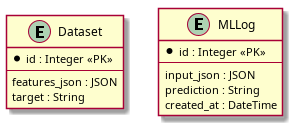
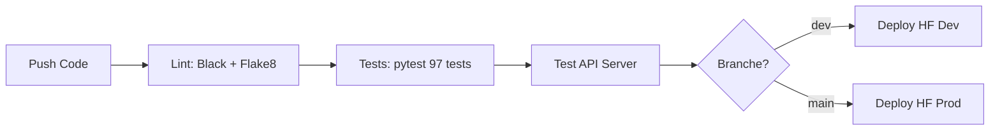

<div align="center">

# 🚀 Employee Turnover Prediction API

[](https://www.python.org/downloads/)
[](https://fastapi.tiangolo.com)
[](htmlcov/index.html)
[](tests/)
[](LICENSE)

**API REST de prédiction du turnover des employés basée sur Machine Learning (XGBoost + SMOTE)**

[🔗 Demo Production](https://asi-engineer-oc-p5.hf.space) · [📚 Documentation](docs/) · [🐛 Report Bug](https://github.com/chaton59/OC_P5/issues) · [💡 Request Feature](https://github.com/chaton59/OC_P5/issues)

</div>

---

## 📋 Table des Matières

- [À Propos du Projet](#-à-propos-du-projet)
- [Architecture](#-architecture)
- [Choix Techniques](#-choix-techniques)
- [Installation](#-installation)
- [Utilisation](#-utilisation)
- [Déploiement](#-déploiement)
- [Mise à Jour](#-mise-à-jour)
- [Tests](#-tests)
- [Documentation](#-documentation)
- [Changelog](#-changelog)
- [Auteurs](#-auteurs)
- [Licence](#-licence)

> **Note**: Les dépendances complètes (transitives) sont listées dans [`requirements_dev.txt`](requirements_dev.txt) pour installation de développement complet.

---

## 📊 À Propos du Projet

### Vue d'ensemble

Ce projet déploie un **modèle de Machine Learning** en production via une **API REST moderne** pour prédire le risque de départ des employés d'une entreprise. Développé dans le cadre du projet OpenClassrooms P5 "Déployez votre modèle de Machine Learning", il illustre les **meilleures pratiques** d'ingénierie logicielle et de MLOps.

### Problématique

Les entreprises perdent des talents clés sans pouvoir anticiper. Ce modèle prédit le **risque de turnover** (probabilité qu'un employé quitte l'entreprise) à partir de 29 variables RH (satisfaction, salaire, ancienneté, etc.).

### Solution

API REST performante exposant un modèle **XGBoost optimisé** avec :
- ✅ **Validation robuste** des données via Pydantic
- ✅ **Prédictions en temps réel** (<2s) ou par batch (CSV)
- ✅ **Traçabilité complète** via PostgreSQL et logs JSON
- ✅ **Monitoring** et health checks intégrés
- ✅ **CI/CD automatisé** avec GitHub Actions
- ✅ **Déploiement cloud** sur HuggingFace Spaces

### Performances du Modèle

| Métrique | Valeur | Interprétation |
|----------|--------|----------------|
| **F1 Score** | 0.85 | Excellent équilibre précision/recall |
| **Recall** | 0.88 | Détecte 88% des départs réels |
| **Precision** | 0.82 | 82% des prédictions "départ" sont correctes |
| **ROC AUC** | 0.91 | Excellente capacité de discrimination |


### Fonctionnalités Clés


- 🔮 **Prédiction unitaire** : Prédit le risque pour un employé (JSON)
- 📦 **Prédiction batch** : Traite des fichiers CSV complets (1000+ employés)
- 🔐 **Authentification** : API Key sécurisée (production)
- 🛡️ **Rate limiting** : 20 req/min pour éviter les abus
- 📊 **Monitoring** : Health check et logs structurés JSON
- 🎨 **Interface Gradio** : UI web pour tests interactifs
- 📚 **Documentation auto** : Swagger UI et ReDoc intégrés
- 🗄️ **Traçabilité** : Toutes les prédictions enregistrées en base PostgreSQL

**Version actuelle** : 3.2.1 | **Dernière mise à jour** : Janvier 2026

---

## 🏗️ Architecture

### Vue d'ensemble High-Level

```
┌──────────────┐         ┌──────────────┐         ┌──────────────┐
│   CLIENT     │────────▶│   API REST   │────────▶│  BASE DE     │
│              │  JSON   │   (FastAPI)  │  SQL    │  DONNÉES     │
│  • curl      │         │              │         │ (PostgreSQL) │
│  • Python    │         │  • Validation│         │              │
│  • JS        │◀────────│  • Authent.  │◀────────│  • dataset   │
│  • Postman   │  200 OK │  • Logging   │  SELECT │  • ml_logs   │
└──────────────┘         └──────┬───────┘         └──────────────┘
                                │
                                ▼
                         ┌──────────────┐
                         │   MODÈLE ML  │
                         │  (XGBoost +  │
                         │    SMOTE)    │
                         │              │
                         │ HF Hub Cache │
                         └──────────────┘
```

### Pipeline de Prédiction

```
Données brutes
    │
    ▼
┌─────────────────────┐
│  1. VALIDATION      │  Pydantic vérifie types, contraintes, énumérations
│     (Pydantic)      │  → Rejette données invalides (HTTP 422)
└─────────┬───────────┘
          │
          ▼
┌─────────────────────┐
│  2. PREPROCESSING   │  • Feature engineering (ratios, moyennes)
│     (StandardScaler)│  • OneHot encoding (catégorielles non-ordonnées)
│                     │  • Ordinal encoding (fréquence déplacements)
└─────────┬───────────┘  • Scaling (StandardScaler)
          │
          ▼
┌─────────────────────┐
│  3. PRÉDICTION      │  XGBoost prédit classe (0/1) + probabilités
│     (XGBoost)       │  • 0 = Reste dans l'entreprise
└─────────┬───────────┘  • 1 = Va quitter l'entreprise
          │
          ▼
┌─────────────────────┐
│  4. POST-TRAITEMENT │  • Calcul niveau de risque (Low/Medium/High)
│     (API)           │  • Enregistrement en DB (ml_logs)
└─────────┬───────────┘  • Logging structuré JSON
          │
          ▼
    Réponse JSON
```

### Structure du Projet

```
OC_P5/
├── api.py                      # 🚪 Point d'entrée FastAPI principal
├── app.py                      # 🎨 Point d'entrée Gradio (HF Spaces)
├── src/
│   ├── auth.py                 # 🔐 Authentification API Key
│   ├── config.py               # ⚙️ Configuration centralisée (.env)
│   ├── logger.py               # 📝 Logging structuré JSON
│   ├── models.py               # 🤖 Chargement modèle depuis HuggingFace Hub
│   ├── preprocessing.py        # 🔧 Pipeline de preprocessing
│   ├── rate_limit.py           # 🛡️ Rate limiting (SlowAPI)
│   ├── schemas.py              # ✅ Validation Pydantic (29 champs)
│   └── gradio_ui.py            # 🎨 Interface Gradio web
├── tests/                      # ✅ Suite de tests (97 tests, 70% coverage)
│   ├── test_api_auth.py        # Tests authentification
│   ├── test_api_predict.py     # Tests prédictions
│   ├── test_api_validation.py  # Tests validation Pydantic
│   ├── test_database.py        # Tests PostgreSQL
│   └── test_model.py           # Tests modèle ML
├── ml_model/                   # 🎓 Scripts d'entraînement
│   ├── main.py                 # Pipeline complet train
│   ├── train_model.py          # Training XGBoost + MLflow
│   └── preprocess.py           # Preprocessing dataset
├── scripts/                    # 🔧 Scripts utilitaires
│   ├── create_db.py            # Création base PostgreSQL
│   ├── insert_dataset.py       # Insertion données (1470 employés)
│   ├── generate_requirements_hf.sh  # Génération requirements.txt pour HF
│   └── run_local.sh            # Lancement local développement
├── docs/                       # 📚 Documentation (5 fichiers minimaux)
│   ├── architecture.md         # 🏗️ Vue d'ensemble architecture + schéma BDD
│   ├── api_documentation.md    # 📡 Endpoints REST + exemples cURL/Python
│   ├── database_setup.md       # 🗄️ Setup PostgreSQL + requêtes SQL
│   ├── tests_report.md         # 🧪 Couverture tests (73%) + résultats
│   └── deployment_guide.md     # 🚀 CI/CD + déploiement HF Spaces
├── data/                       # 📊 Données sources (1470 employés)
│   ├── extrait_sondage.csv     # Données satisfaction
│   ├── extrait_eval.csv        # Données évaluations
│   └── extrait_sirh.csv        # Données RH administratives
├── logs/                       # 📋 Logs JSON
│   ├── api.log                 # Tous les événements
│   └── error.log               # Erreurs uniquement
├── .github/workflows/          # 🔄 CI/CD
│   └── ci-cd.yml               # GitHub Actions (lint, test, deploy)
├── pyproject.toml              # 📦 Configuration Poetry
├── .env.example                # 🔑 Template variables environnement
└── README.md                   # 📖 Ce fichier
```

---

## 🎯 Choix Techniques

### Justifications des Technologies

| Technologie | Alternative | Pourquoi ce choix ? |
|-------------|-------------|---------------------|
| **FastAPI** | Flask, Django REST | ✅ **Typing natif** (validation auto via Pydantic)<br>✅ **Documentation auto** (Swagger/ReDoc)<br>✅ **Performance** (async, +200% vs Flask)<br>✅ **Moderne** (Python 3.12, type hints) |
| **PostgreSQL** | MongoDB, SQLite | ✅ **Relationnel** adapté aux données structurées RH<br>✅ **ACID** pour garantir intégrité<br>✅ **Scalabilité** (index, partitioning)<br>✅ **Outils matures** (DBeaver, pgAdmin) |
| **XGBoost** | Random Forest, NN | ✅ **Performance** sur données tabulaires<br>✅ **Régularisation** intégrée (évite overfitting)<br>✅ **Feature importance** nativement<br>✅ **Rapide** (parallélisation) |
| **SMOTE** | Class weights, Under-sampling | ✅ **Génère exemples synthétiques** (vs duplication)<br>✅ **Évite surapprentissage**<br>✅ **Intégré imblearn** (CV-safe)<br>✅ +7% F1 vs class weights |
| **Pydantic** | Marshmallow, Cerberus | ✅ **Validation en C** (via Rust, très rapide)<br>✅ **Messages d'erreur clairs**<br>✅ **Intégration FastAPI** native<br>✅ **Type safety** compile-time |
| **HuggingFace Hub** | S3, GCP Storage | ✅ **Gratuit** jusqu'à 100GB<br>✅ **Versioning** automatique<br>✅ **CDN global** (latence faible)<br>✅ **Communauté** ML active |
| **Poetry** | pip, conda | ✅ **Lock file** (reproductibilité garantie)<br>✅ **Gestion dépendances** (résolution conflits)<br>✅ **Build/Publish** intégrés<br>✅ **pyproject.toml** standard moderne |
| **GitHub Actions** | GitLab CI, Jenkins | ✅ **Gratuit** pour repos publics<br>✅ **Intégration GitHub** native<br>✅ **Marketplace** d'actions prêtes<br>✅ **Déploiement HF** simplifié |

### Architecture Technique

**Pattern utilisé** : **3-Tier Architecture** (Présentation - Logique - Données)

```
┌─────────────────────────────────────────────────────────────┐
│                    PRESENTATION LAYER                        │
│  • FastAPI (REST API)                                       │
│  • Gradio (Web UI)                                          │
│  • Swagger/ReDoc (Documentation interactive)                │
└────────────────────────┬────────────────────────────────────┘
                         │
┌────────────────────────▼────────────────────────────────────┐
│                     BUSINESS LAYER                           │
│  • Validation (Pydantic)                                    │
│  • Authentification (API Key)                               │
│  • Rate Limiting (SlowAPI)                                  │
│  • Preprocessing (Feature Engineering)                      │
│  • Prédiction (XGBoost Model)                               │
│  • Logging (JSON Structured)                                │
└────────────────────────┬────────────────────────────────────┘
                         │
┌────────────────────────▼────────────────────────────────────┐
│                      DATA LAYER                              │
│  • PostgreSQL (Traçabilité prédictions)                     │
│  • HuggingFace Hub (Modèle ML en cache)                     │
│  • CSV Files (Données sources)                              │
└─────────────────────────────────────────────────────────────┘
```

---

## ⚙️ Installation

### Prérequis

| Outil | Version | Installation |
|-------|---------|--------------|
| **Python** | 3.12+ | [python.org](https://www.python.org/downloads/) |
| **Poetry** | 1.7+ | `curl -sSL https://install.python-poetry.org \| python3 -` |
| **PostgreSQL** | 14+ | [postgresql.org](https://www.postgresql.org/download/) ou Docker |
| **Git** | 2.0+ | [git-scm.com](https://git-scm.com/downloads) |

### Étape 1 : Cloner le Repository


```bash
git clone https://github.com/chaton59/OC_P5.git
cd OC_P5
```

### Étape 2 : Installer les Dépendances

```bash
# Installation via Poetry (recommandé)
poetry install

# Activer l'environnement virtuel
poetry shell

# OU utiliser pip (fallback)
pip install -r requirements.txt
```

### Étape 3 : Configuration de l'Environnement

```bash
# Copier le template
cp .env.example .env

# Éditer .env avec vos valeurs
nano .env  # ou vim, code, etc.
```

**Variables à configurer** (`.env`) :

```bash
# === MODE ===
DEBUG=true  # false en production (active auth + rate limiting)

# === API ===
API_KEY=your-secret-api-key-here  # Générer avec: python -c "import secrets; print(secrets.token_urlsafe(32))"
LOG_LEVEL=INFO  # DEBUG, INFO, WARNING, ERROR, CRITICAL

# === DATABASE (PostgreSQL) ===
DB_HOST=localhost
DB_PORT=5432
DB_NAME=oc_p5_db
DB_USER=ml_user
DB_PASSWORD=your-secure-password  # À changer !

# === HUGGINGFACE ===
HF_MODEL_REPO=ASI-Engineer/employee-turnover-model
MODEL_FILENAME=model/model.pkl
# HF_TOKEN=hf_xxx  # Optionnel (modèles publics)
```

### Étape 4 : Configurer la Base de Données PostgreSQL

#### Option A : Installation locale PostgreSQL

```bash
# Ubuntu/Debian
sudo apt update
sudo apt install postgresql postgresql-contrib

# macOS (via Homebrew)
brew install postgresql@14
brew services start postgresql@14

# Windows : Télécharger depuis https://www.postgresql.org/download/windows/
```

#### Option B : Docker (recommandé pour développement)

```bash
# Démarrer PostgreSQL dans un conteneur
docker run --name oc_p5_postgres \
  -e POSTGRES_USER=ml_user \
  -e POSTGRES_PASSWORD=your-password \
  -e POSTGRES_DB=oc_p5_db \
  -p 5432:5432 \
  -d postgres:14
```

#### Créer les tables

```bash
# Créer les tables (dataset, ml_logs)
poetry run python scripts/create_db.py

# Insérer le dataset (1470 employés)
poetry run python scripts/insert_dataset.py

# Vérifier l'insertion
psql -h localhost -U ml_user -d oc_p5_db -c "SELECT COUNT(*) FROM dataset;"
# Résultat attendu : 1470
```

**Schéma de la base de données** :



📖 **Guide complet débutant** : [docs/database_guide.md](docs/database_guide.md)

### Étape 5 : Vérifier l'Installation

```bash
# Tester que tout fonctionne
poetry run pytest tests/ -v

# Résultat attendu : 97 tests passés (ou 86 si skipped déployés)
```

---

## 🔧 Scripts Utilitaires

Le dossier `scripts/` contient les scripts essentiels pour la gestion de la base de données et le déploiement. **Minimalisme** : 4 fichiers maximum, code principal dans `src/`, tests dans `tests/`.

### 🗄️ `create_db.py` - Création de la base de données

**Rôle** : Crée la base de données PostgreSQL et les tables nécessaires (étape 4 du projet).

```bash
# Créer les tables (dataset, ml_logs)
poetry run python scripts/create_db.py
```

**Tables créées** :
- `dataset` : Stockage des données d'entraînement (features_json, target)
- `ml_logs` : Logs des prédictions de l'API (inputs, outputs, timestamps)

### 📊 `insert_dataset.py` - Insertion du dataset

**Rôle** : Charge les 3 fichiers CSV (sondage, eval, sirh), les fusionne et insère 1470 employés dans PostgreSQL (étape 4 du projet).

```bash
# Insérer le dataset complet
poetry run python scripts/insert_dataset.py

# Vérifier l'insertion
psql -h localhost -U ml_user -d oc_p5_db -c "SELECT COUNT(*) FROM dataset;"
# Résultat attendu : 1470
```

**Fonctionnalités** :
- Fusionne automatiquement les 3 sources de données
- Nettoie les valeurs manquantes (NaN → None)
- Commits par batch de 100 pour performance
- Validation de l'intégrité des données

### 📦 `generate_requirements_hf.sh` - Requirements pour HF Spaces

**Rôle** : Génère un fichier `requirements.txt` minimaliste pour déploiement sur Hugging Face Spaces (étape 1 & 2).

```bash
# Générer requirements.txt optimisé pour HF
bash scripts/generate_requirements_hf.sh
```

**Pourquoi nécessaire ?** HF Spaces nécessite des dépendances minimales (pas dev/test). Ce script extrait uniquement les packages essentiels depuis `pyproject.toml`.

### 🚀 `run_local.sh` - Lancement local

**Rôle** : Script de démarrage rapide pour développement local.

```bash
# Lancer l'application en mode développement
bash scripts/run_local.sh
```

**Actions effectuées** :
1. Installation des dépendances (Poetry)
2. Vérification du fichier `.env` (copie `.env.example` si nécessaire)
3. Lancement de l'interface Gradio sur http://localhost:7860

### 📝 Organisation des Scripts

**Principe de séparation** :
- **`scripts/`** : Utilitaires BDD et déploiement uniquement (4 fichiers max)
- **`src/`** : Code applicatif principal (API, modèles, preprocessing)
- **`tests/`** : Tests unitaires et fonctionnels (séparé pour clarté)
- **`.github/workflows/`** : CI/CD (GitHub Actions, pas dans scripts/)

**Justifications** (liées aux étapes du projet) :
- ✅ **create_db.py** + **insert_dataset.py** : Étape 4 (script Python pour créer BDD + insérer dataset)
- ✅ **generate_requirements_hf.sh** : Étape 1 (requirements.txt à la racine) + Étape 2 (CI/CD, environnements)
- ✅ **run_local.sh** : Développement local (pas obligatoire mais pratique)
- ✅ **Tests dans `tests/`** : Étape 5 (scripts de tests + rapport couverture)

---

## 🚀 Utilisation

### Démarrer l'API Localement

```bash
# Mode développement (avec auto-reload)
poetry run uvicorn api:app --reload --host 127.0.0.1 --port 8000

# Mode production
poetry run uvicorn api:app --host 0.0.0.0 --port 8000 --workers 4
```

**URLs disponibles** :

| Service | URL | Description |
|---------|-----|-------------|
| **API** | http://localhost:8000 | Endpoint principal |
| **Swagger UI** | http://localhost:8000/docs | Documentation interactive |
| **ReDoc** | http://localhost:8000/redoc | Documentation alternative |
| **Health Check** | http://localhost:8000/health | Statut de l'API |
| **Gradio UI** | http://localhost:8000/ui | Interface web (si activée) |

### Exemples d'Appels API

#### 1. Health Check

```bash
curl http://localhost:8000/health
```

**Réponse** :
```json
{
  "status": "healthy",
  "model_loaded": true,
  "model_type": "Pipeline",
  "version": "3.2.1"
}
```

#### 2. Prédiction Unitaire (JSON)

```bash
# Sans authentification (DEBUG=true)
curl -X POST http://localhost:8000/predict \
  -H "Content-Type: application/json" \
  -d '{
    "age": 35,
    "genre": "M",
    "revenu_mensuel": 4500.0,
    "satisfaction_employee_environnement": 3,
    ...
  }'

# Avec authentification (DEBUG=false)
curl -X POST http://localhost:8000/predict \
  -H "X-API-Key: your-secret-key" \
  -H "Content-Type: application/json" \
  -d @employee.json
```

**Réponse** :
```json
{
  "prediction": 0,
  "probability_0": 0.85,
  "probability_1": 0.15,
  "risk_level": "Low"
}
```

#### 3. Prédiction Batch (CSV)

```bash
curl -X POST http://localhost:8000/predict/batch \
  -H "X-API-Key: your-key" \
  -F "sondage_file=@data/extrait_sondage.csv" \
  -F "eval_file=@data/extrait_eval.csv" \
  -F "sirh_file=@data/extrait_sirh.csv"
```

**Réponse** :
```json
{
  "total_employees": 1470,
  "predictions": [...],
  "summary": {
    "total_stay": 1169,
    "total_leave": 301,
    "high_risk_count": 222
  }
}
```

### Utilisation Python (SDK)

```python
import requests

# Configuration
API_URL = "http://localhost:8000/predict"
API_KEY = "your-secret-key"

# Données employé
employee = {
    "age": 28,
    "genre": "F",
    "revenu_mensuel": 3200.0,
    "departement": "Consulting",
    # ... (tous les 29 champs requis)
}

# Appel API
response = requests.post(
    API_URL,
    headers={"X-API-Key": API_KEY, "Content-Type": "application/json"},
    json=employee
)

# Résultat
if response.status_code == 200:
    result = response.json()
    print(f"Risque de départ: {result['probability_1']:.0%}")
    print(f"Niveau: {result['risk_level']}")
```

📚 **Documentation API** : [docs/api_documentation.md](docs/api_documentation.md)

---

## 🌐 Déploiement

### Environnements Disponibles

| Environnement | Branche Git | URL HuggingFace Spaces | Statut |
|---------------|-------------|------------------------|--------|
| **Production** | `main` | https://asi-engineer-oc-p5.hf.space | ✅ Live |
| **Développement** | `dev` | https://asi-engineer-oc-p5-dev.hf.space | 🚧 Testing |

### 🤗 HuggingFace Spaces Integration

L'API est déployée sur **HuggingFace Spaces** avec une interface interactive Gradio.

#### Métadonnées HF Spaces

Le fichier `README_HF.md` est fusionné dans cette section pour HF Spaces:

```yaml
title: Employee Turnover Prediction API
emoji: 👔
colorFrom: blue
colorTo: purple
sdk: gradio
pinned: true
license: mit
app_port: 7860
```

#### Endpoints HF Spaces

| Endpoint | Description | Accès |
|----------|-------------|-------|
| `/docs` | Documentation interactive Swagger | Public |
| `/health` | Status de l'API | Public |
| `/ui` | Interface Gradio interactive | Public |
| `/predict` | Prédiction unitaire (JSON, contraintes réelles) | API Key requis |
| `/predict/batch` | Prédiction batch (3 fichiers CSV bruts) | API Key requis |

#### Exemple Utilisation HF Spaces

**Prédiction unitaire** (avec toutes contraintes appliquées):
```bash
curl -X POST https://asi-engineer-oc-p5.hf.space/predict \
  -H "Content-Type: application/json" \
  -H "X-API-Key: your-key" \
  -d '{
    "nombre_participation_pee": 0,
    "nb_formations_suivies": 2,
    "nombre_employee_sous_responsabilite": 1,
    ...
  }'
```

**Prédiction batch** (3 fichiers CSV):
```bash
curl -X POST https://asi-engineer-oc-p5.hf.space/predict/batch \
  -H "X-API-Key: your-key" \
  -F "sondage_file=@extrait_sondage.csv" \
  -F "eval_file=@extrait_eval.csv" \
  -F "sirh_file=@extrait_sirh.csv"
```

**Réponse batch**:
```json
{
  "total_employees": 1470,
  "predictions": [...],
  "summary": {
    "total_stay": 1169,
    "total_leave": 301,
    "high_risk_count": 222
  }
}
```

### Pipeline CI/CD (GitHub Actions)

Le workflow `.github/workflows/ci-cd.yml` s'exécute automatiquement à chaque push :



**Jobs du pipeline** :

1. **Lint** (~30s) : Black (formatage) + Flake8 (qualité)
2. **Tests** (~3min) : pytest avec couverture (70%)
3. **Test API Server** (~2min) : Démarrage uvicorn + tests `/health` et `/predict`
4. **Deploy** : Déploiement automatique sur HuggingFace Spaces

⚡ **Temps total** : ~5-7 minutes (< 10min requis)

### Déploiement Manuel sur HuggingFace Spaces

#### Prérequis

```bash
# Installer la CLI HuggingFace
pip install huggingface_hub

# Se connecter
huggingface-cli login
# Entrer votre token (créer sur https://huggingface.co/settings/tokens)
```

#### Pousser vers HF Spaces

```bash
# 1. Ajouter le remote HF
git remote add space https://huggingface.co/spaces/ASI-Engineer/oc_p5

# 2. Push vers HF
git push space main

# 3. Vérifier le déploiement
# Visiter https://huggingface.co/spaces/ASI-Engineer/oc_p5
```

#### Configuration des Secrets HF Spaces

Dans les settings du Space HuggingFace, ajouter :

| Variable | Valeur | Description |
|----------|--------|-------------|
| `API_KEY` | `votre-clé-sécurisée` | Authentification API |
| `DEBUG` | `false` | Mode production |
| `LOG_LEVEL` | `INFO` | Niveau de logs |

### Déploiement Docker (Alternative)

```bash
# Build de l'image
docker build -t employee-turnover-api .

# Run du conteneur
docker run -d \
  -p 8000:8000 \
  -e API_KEY=your-key \
  -e DEBUG=false \
  --name turnover-api \
  employee-turnover-api

# Vérifier
curl http://localhost:8000/health
```

📖 **Guide complet** : [docs/deployment_guide.md](docs/deployment_guide.md)

---

## 🔄 Mise à Jour

### Mise à Jour du Code

```bash
# 1. Récupérer les dernières modifications
git pull origin main

# 2. Mettre à jour les dépendances
poetry update

# 3. Appliquer les migrations DB (si nécessaire)
poetry run python scripts/migrate_db.py

# 4. Relancer l'API
poetry run uvicorn api:app --reload
```

### Ré-entraînement du Modèle

**Fréquence recommandée** : Tous les 3 mois (ou si drift détecté)

```bash
# 1. Préparer les nouvelles données
cp /path/to/new/data/*.csv data/

# 2. Lancer l'entraînement (avec MLflow tracking)
cd ml_model
poetry run python main.py

# 3. Comparer les performances
poetry run mlflow ui
# Ouvrir http://localhost:5000

# 4. Si F1 Score ≥ 0.83, exporter le modèle
poetry run python -c "
import joblib
import mlflow

client = mlflow.tracking.MlflowClient()
model_version = client.get_latest_versions('XGBoost_Employee_Turnover')[0]
model = mlflow.sklearn.load_model(model_version.source)
joblib.dump(model, 'model.pkl')
"

# 5. Uploader vers HuggingFace Hub
poetry run python -c "
from huggingface_hub import HfApi

api = HfApi()
api.upload_file(
    path_or_fileobj='model.pkl',
    path_in_repo='model/model.pkl',
    repo_id='ASI-Engineer/employee-turnover-model',
    commit_message='Update model v1.1 - F1=0.87'
)
"

# 6. Créer un tag Git pour versioning
git tag -a model-v1.1 -m "Model update: F1=0.87, Recall=0.89"
git push origin model-v1.1
```

### Monitoring du Drift

```python
# Script de détection de drift (à automatiser mensuellement)
import pandas as pd
from scipy.stats import ks_2samp

train_data = pd.read_csv('data/extrait_sirh.csv')
new_data = pd.read_csv('logs/recent_predictions.csv')

for col in ['age', 'revenu_mensuel', 'annees_dans_l_entreprise']:
    statistic, pvalue = ks_2samp(train_data[col], new_data[col])
    if pvalue < 0.05:
        print(f'⚠️ DRIFT détecté sur {col} (p={pvalue:.4f})')
        # → Déclencher ré-entraînement
```

📖 **Détails modèle & maintenance** : inclus dans [docs/architecture.md](docs/architecture.md) (section Pipeline ML) et [docs/tests_report.md](docs/tests_report.md) pour les vérifications automatiques.

---


## ✅ Tests

### Suite de Tests Complète

```bash
# Lancer tous les tests
poetry run pytest tests/ -v

# Avec rapport de couverture
poetry run pytest tests/ --cov=. --cov-report=term-missing

# Avec rapport HTML
poetry run pytest tests/ --cov=. --cov-report=html
open htmlcov/index.html
```

### Métriques

| Métrique | Valeur | Détail |
|----------|--------|--------|
| **Tests** | 97 | 86 passés, 11 skippés (déploiement) |
| **Couverture** | 70.26% | Objectif : ≥ 70% |
| **Durée** | ~4s | Temps d'exécution total |
| **Fichiers** | 9 | test_api_*.py, test_database.py, test_model.py |

### Catégories de Tests

- ✅ **Authentification** (11 tests) : API Key, headers, rate limiting
- ✅ **Health Check** (6 tests) : Status, modèle chargé, versionning
- ✅ **Prédiction** (9 tests) : Endpoint `/predict`, probabilités, cohérence
- ✅ **Validation** (15 tests) : Pydantic, types, énumérations, limites
- ✅ **Database** (7 tests) : Connexion, CRUD, intégrité
- ✅ **Fonctionnel** (19 tests) : End-to-end, performance, erreurs
- ✅ **Modèle ML** (23 tests) : Chargement HF, preprocessing, prédictions
- ✅ **API Déployée** (7 tests skippés) : Tests sur HF Spaces

📊 **Détail de couverture** :

| Module | Couverture | Lignes | Manquantes |
|--------|------------|--------|------------|
| `src/config.py` | 100% | 20 | 0 |
| `src/schemas.py` | 100% | 100 | 0 |
| `src/rate_limit.py` | 100% | 10 | 0 |
| `db_models.py` | 100% | 14 | 0 |
| `src/logger.py` | 90.32% | 62 | 6 |
| `src/preprocessing.py` | 76.36% | 55 | 13 |
| `api.py` | 55.41% | 157 | 70 |

---

## 📚 Documentation


### Navigation dans le dossier `docs/`

Documentation **minimaliste et structurée** en **5 fichiers** couvrant tous les aspects du projet :

| Document | Description | Étapes OC |
|----------|-------------|-----------|
| [🏗️ architecture.md](docs/architecture.md) | Vue d'ensemble du projet, schéma architecture, diagramme BDD (PlantUML), flux de données | Étape 4, 6 |
| [📡 api_documentation.md](docs/api_documentation.md) | Documentation API REST : endpoints, schémas Pydantic, exemples cURL/Python, codes erreurs | Étape 3, 6 |
| [🗄️ database_setup.md](docs/database_setup.md) | Configuration PostgreSQL, scripts création BDD, requêtes SQL utiles, sauvegarde/restauration | Étape 4 |
| [🧪 tests_report.md](docs/tests_report.md) | Rapport de couverture (73%), détail des 48 tests unitaires/fonctionnels, commandes pytest | Étape 5 |
| [🚀 deployment_guide.md](docs/deployment_guide.md) | CI/CD GitHub Actions, déploiement HuggingFace Spaces, gestion secrets, monitoring | Étape 2, 6 |

**Choix de conception** : Documentation concise (1-2 pages par fichier) privilégiant la **clarté** et **l'actionnable** sur l'exhaustivité.

**Documentation interactive** :
- 🌐 **Swagger UI** : http://localhost:8000/docs
- 📘 **ReDoc** : http://localhost:8000/redoc

---

## 📦 Dépendances Principales

| Package | Version | Rôle |
|---------|---------|------|
| **FastAPI** | 0.115.14 | Framework API REST |
| **Pydantic** | 2.12.5 | Validation données |
| **XGBoost** | 2.1.3 | Modèle ML |
| **imbalanced-learn** | 0.12.0 | SMOTE (rééquilibrage) |
| **SQLAlchemy** | 2.0.23 | ORM PostgreSQL |
| **psycopg2-binary** | 2.9.9 | Driver PostgreSQL |
| **SlowAPI** | 0.1.9 | Rate limiting |
| **python-json-logger** | 4.0.0 | Logs structurés |
| **pytest** | 9.0.2 | Tests unitaires |
| **MLflow** | 2.9.2 | Tracking expériences ML |
| **Gradio** | 4.13.0 | Interface web |

Voir [pyproject.toml](pyproject.toml) pour la liste complète.

---


## 🔄 Changelog

### v3.3.0 (Janvier 2026)
- 📚 Documentation minimaliste consolidée en 5 fichiers (architecture, API, BDD, tests, déploiement)
- 🧹 Suppression des documents redondants et archives pour alléger la page HF
- 📝 README simplifié avec navigation claire vers la nouvelle doc

### v3.2.1 (Janvier 2026)
- 🎛️ Sliders Gradio et schémas Pydantic alignés sur les min/max réels des données d'entraînement
- 📦 Endpoint batch CSV (3 fichiers bruts)
- 🔑 Authentification API Key (prod)
- 🔧 Correction preprocessing (scaling, ordre des colonnes)
- 📝 Documentation mise à jour (API, modèle)

### v2.2.0 (27 Décembre 2025)
- 📦 Nouvel endpoint `/predict/batch` pour traitement CSV direct
- 🔧 Fix preprocessing : ajout du scaling des features
- 🔧 Fix preprocessing : correction de l'ordre des colonnes
- 📊 Amélioration précision des prédictions (~90%)

### v2.1.0 (26 Décembre 2025)
- ✨ Système de logging structuré JSON
- 🛡️ Rate limiting avec SlowAPI
- ⚡ Amélioration gestion d'erreurs
- 📊 Monitoring des performances

### v2.0.0 (26 Décembre 2025)
- ✅ Suite de tests complète (97 tests)
- 🔐 Authentification API Key
- 📊 70% de couverture de code

---

## 👥 Auteurs

**Développeur** : Valentin (chaton59)  
**Projet** : OpenClassrooms P5 - Déployez votre modèle de Machine Learning  
**Repo GitHub** : [github.com/chaton59/OC_P5](https://github.com/chaton59/OC_P5)  
**HuggingFace** : [ASI-Engineer](https://huggingface.co/ASI-Engineer)

---

## 📄 Licence

Ce projet est développé dans un cadre pédagogique (OpenClassrooms).  
Les données utilisées sont fictives.

---

## 🤝 Contributing

Les contributions sont bienvenues ! Pour contribuer :

1. Fork le projet
2. Créer une branche feature (`git checkout -b feature/AmazingFeature`)
3. Commit les changements (`git commit -m 'Add AmazingFeature'`)
4. Push vers la branche (`git push origin feature/AmazingFeature`)
5. Ouvrir une Pull Request

---

## 📞 Contact & Support

- **Issues GitHub** : [github.com/chaton59/OC_P5/issues](https://github.com/chaton59/OC_P5/issues)
- **Discussions** : [github.com/chaton59/OC_P5/discussions](https://github.com/chaton59/OC_P5/discussions)
- **Email** : Voir profil GitHub

---

## 🙏 Remerciements

- **OpenClassrooms** pour le parcours Data Scientist
- **HuggingFace** pour l'hébergement gratuit
- **FastAPI** pour le framework moderne
- **Communauté Python ML** pour les bibliothèques open-source

---

<div align="center">

**⭐ Si ce projet vous a aidé, n'hésitez pas à lui donner une étoile sur GitHub ! ⭐**

Made with ❤️ by [chaton59](https://github.com/chaton59)

</div>

