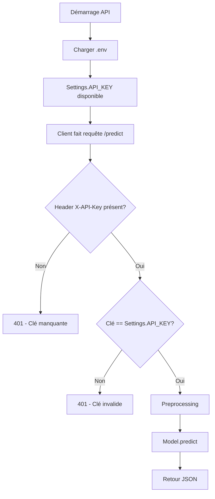

# 🔐 Authentification API - Guide Complet

## 📖 Comment ça marche ?

### 1️⃣ **Concept de base**

L'authentification par API Key est une méthode simple mais efficace pour sécuriser une API.

**Analogie** : C'est comme un badge d'accès à un bâtiment
- Sans badge → La porte reste fermée (401 Unauthorized)
- Avec mauvais badge → Accès refusé (401 Unauthorized)  
- Avec bon badge → Porte ouverte, bienvenue ! (200 OK)

### 2️⃣ **Fonctionnement technique**

```
┌─────────────┐              ┌─────────────┐
│   Client    │              │     API     │
│  (Vous)     │              │  (FastAPI)  │
└─────────────┘              └─────────────┘
       │                             │
       │  POST /predict              │
       │  Header: X-API-Key: abc123  │
       │─────────────────────────────>│
       │                             │
       │                  ┌──────────▼──────────┐
       │                  │ verify_api_key()    │
       │                  │ Compare: abc123 ==? │
       │                  │ Stored: abc123      │
       │                  └──────────┬──────────┘
       │                             │
       │                          [MATCH]
       │                             │
       │                  ┌──────────▼──────────┐
       │                  │  predict()          │
       │                  │  Preprocessing      │
       │                  │  Model.predict()    │
       │                  └──────────┬──────────┘
       │                             │
       │  {"prediction": 1, ...}     │
       │<─────────────────────────────│
       │                             │
```

### 3️⃣ **Où est stockée la clé ?**

**Fichier `.env`** (jamais dans Git !) :
```bash
API_KEY=votre-cle-secrete-ici
DEBUG=False  # Active l'authentification
```

**Chargée dans `src/config.py`** :
```python
from dotenv import load_dotenv
load_dotenv()  # Charge .env

class Settings:
    API_KEY = os.getenv("API_KEY", "default-dev-key")
```

### 4️⃣ **Comment l'API vérifie ?**

**Fichier `src/auth.py`** :

```python
async def verify_api_key(x_api_key: str = Header(None)):
    settings = get_settings()
    
    # Étape 1: Vérifier que le header existe
    if not x_api_key:
        raise HTTPException(401, "API Key manquante")
    
    # Étape 2: Comparer avec la clé configurée
    if x_api_key != settings.API_KEY:
        raise HTTPException(401, "API Key invalide")
    
    # Étape 3: Si OK, continuer
    return x_api_key
```

**Intégration dans `app.py`** :
```python
@app.post(
    "/predict",
    dependencies=[Depends(verify_api_key)]  # ← Protection activée !
)
async def predict(employee: EmployeeInput):
    # Ce code ne s'exécute que si la clé est valide
    ...
```

## 🎯 Cas d'usage

### Mode Développement (DEBUG=True)
```bash
# .env
DEBUG=True

# Requête : pas besoin de clé !
curl http://localhost:8000/predict -H "Content-Type: application/json" -d '{...}'
# ✅ Fonctionne
```

### Mode Production (DEBUG=False)
```bash
# .env
DEBUG=False
API_KEY=ma-super-cle-secrete-xyz789

# Requête SANS clé
curl http://localhost:8000/predict -d '{...}'
# ❌ 401 Unauthorized

# Requête AVEC clé
curl http://localhost:8000/predict \
  -H "X-API-Key: ma-super-cle-secrete-xyz789" \
  -d '{...}'
# ✅ Fonctionne
```

## 🔒 Sécurité

### ✅ Bonnes pratiques

1. **Générer une clé forte**
   ```bash
   python -c "import secrets; print(secrets.token_urlsafe(32))"
   # Résultat: 7xK9_mQ3rN-pLwV8tYz2FhJcE6nBsA4dGvU1iXoM5kR
   ```

2. **Ne JAMAIS committer .env**
   - `.env` est dans `.gitignore`
   - Seul `.env.example` est committé (sans valeur secrète)

3. **Changer la clé régulièrement**
   - Éditez `.env`
   - Redémarrez l'API
   - Distribuez la nouvelle clé aux clients

4. **Utiliser HTTPS en production**
   - HTTP → La clé passe en clair (dangereux !)
   - HTTPS → La clé est chiffrée (sécurisé)

### ⚠️ Limitations actuelles

- ❌ Pas de rotation automatique des clés
- ❌ Pas de gestion multi-utilisateurs (1 seule clé pour tous)
- ❌ Pas de rate limiting (protection contre abus)
- ❌ Pas d'expiration de clé

**Pour du vrai prod** : OAuth2, JWT, ou services comme Auth0.

## 🧪 Tester l'authentification

### Test 1 : Sans clé (doit échouer)
```bash
curl -X POST http://localhost:8000/predict \
  -H "Content-Type: application/json" \
  -d '{...}'

# Réponse attendue (si DEBUG=False)
{
  "detail": {
    "error": "API Key missing",
    "message": "Le header 'X-API-Key' est requis...",
    "solution": "Ajoutez le header: -H 'X-API-Key: votre-cle-api'"
  }
}
```

### Test 2 : Avec mauvaise clé (doit échouer)
```bash
curl -X POST http://localhost:8000/predict \
  -H "X-API-Key: wrong-key" \
  -H "Content-Type: application/json" \
  -d '{...}'

# Réponse attendue
{
  "detail": {
    "error": "Invalid API Key",
    "message": "La clé API fournie est invalide"
  }
}
```

### Test 3 : Avec bonne clé (doit réussir)
```bash
curl -X POST http://localhost:8000/predict \
  -H "X-API-Key: $(grep API_KEY .env | cut -d= -f2)" \
  -H "Content-Type: application/json" \
  -d @test_api.json

# Réponse attendue
{
  "prediction": 1,
  "probability_0": 0.35,
  "probability_1": 0.65,
  "risk_level": "High"
}
```

## 📊 Workflow complet



## 💡 Applications réelles

### Scénario 1 : RH d'une entreprise
```python
# Service RH utilise l'API
import requests

API_KEY = "cle-fournie-par-admin"

response = requests.post(
    "https://api-turnover.company.com/predict",
    headers={"X-API-Key": API_KEY},
    json={...données_employé...}
)

if response.status_code == 200:
    prediction = response.json()
    if prediction["risk_level"] == "High":
        # Déclencher alerte pour manager
        alert_manager(employee_id, prediction)
```

### Scénario 2 : Dashboard web
```javascript
// Frontend React/Vue
const API_KEY = process.env.REACT_APP_API_KEY;

fetch("https://api.company.com/predict", {
  method: "POST",
  headers: {
    "X-API-Key": API_KEY,
    "Content-Type": "application/json"
  },
  body: JSON.stringify(employeeData)
})
.then(res => res.json())
.then(data => displayPrediction(data));
```

### Scénario 3 : Batch processing
```python
# Traiter 1000 employés chaque nuit
import pandas as pd

employees = pd.read_csv("employees.csv")

for _, employee in employees.iterrows():
    response = requests.post(
        API_URL,
        headers={"X-API-Key": API_KEY},
        json=employee.to_dict()
    )
    
    # Sauvegarder prédictions dans DB
    save_prediction(employee["id"], response.json())
```

## 🎓 Résumé

**Authentification API Key** = Méthode simple de sécurisation

**Avantages** :
- ✅ Facile à implémenter
- ✅ Compatible avec tous les clients
- ✅ Révocable facilement
- ✅ Pas besoin de session/cookies

**Inconvénients** :
- ⚠️ Moins sécurisé qu'OAuth2/JWT
- ⚠️ Une seule clé pour tous
- ⚠️ Pas de granularité des permissions

**Parfait pour** : MVP, APIs internes, prototypage
**Améliorer pour prod** : OAuth2, rate limiting, multi-tenancy
