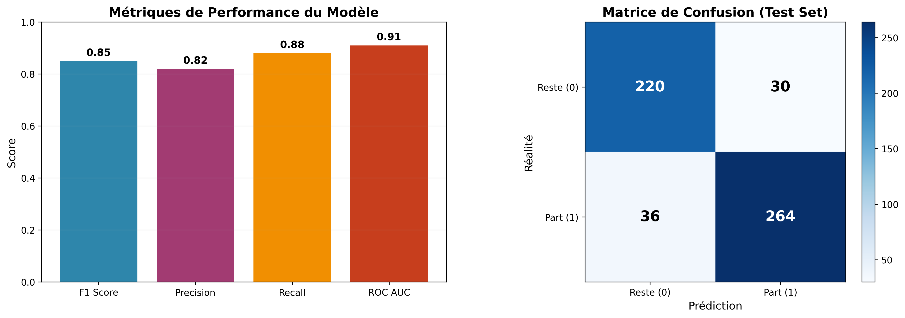

# 🤖 Documentation Technique du Modèle Employee Turnover

**Version du modèle** : 1.0  
**Date de dernière mise à jour** : 1 janvier 2026  
**Algorithme** : XGBoost avec SMOTE  
**Type de problème** : Classification binaire (turnover prediction)

---

## 📋 Table des Matières

1. [Architecture du Modèle](#architecture-du-modèle)
2. [Performances](#performances)
3. [Maintenance et Mise à Jour](#maintenance-et-mise-à-jour)

---

## 🏗️ Architecture du Modèle

### Pipeline de Machine Learning

```
┌─────────────────────────────────────────────────────────────────────────┐
│                        DONNÉES BRUTES (3 SOURCES)                        │
├─────────────────────────────────────────────────────────────────────────┤
│  • extrait_sondage.csv  (satisfaction, formations)                      │
│  • extrait_eval.csv     (évaluations, promotions)                       │
│  • extrait_sirh.csv     (données RH administratives)                    │
└────────────────────────────┬────────────────────────────────────────────┘
                             │
                             ▼
┌─────────────────────────────────────────────────────────────────────────┐
│                    ÉTAPE 1: PRÉPROCESSING                               │
├─────────────────────────────────────────────────────────────────────────┤
│  1. Fusion des 3 datasets (merge sur employee_id)                      │
│  2. Nettoyage:                                                          │
│     • Suppression des duplicatas                                        │
│     • Winsorization des outliers (1% de chaque côté)                   │
│     • Parse des formats (ex: "11 %" → 11.0)                            │
│  3. Feature Engineering:                                                │
│     • revenu_par_anciennete = revenu / (ancienneté + 1)                │
│     • experience_par_anciennete = exp_totale / (ancienneté + 1)        │
│     • satisfaction_moyenne = mean(4 satisfactions)                      │
│     • promo_par_anciennete = années_promo / (ancienneté + 1)           │
│  4. Encoding:                                                           │
│     • OneHot: genre, statut_marital, departement, poste, domaine_etude │
│     • Ordinal: frequence_deplacement (Aucun < Occasionnel < Frequent) │
│  5. Scaling: StandardScaler sur toutes les features numériques         │
└────────────────────────────┬────────────────────────────────────────────┘
                             │
                             ▼
┌─────────────────────────────────────────────────────────────────────────┐
│                  ÉTAPE 2: RÉÉQUILIBRAGE (SMOTE)                         │
├─────────────────────────────────────────────────────────────────────────┤
│  • Synthetic Minority Over-sampling Technique                           │
│  • Génère des exemples synthétiques de la classe minoritaire           │
│  • Ratio original: ~80% reste / 20% part → 50% / 50% après SMOTE       │
│  • Appliqué UNIQUEMENT sur train set (CV-safe via imblearn Pipeline)   │
└────────────────────────────┬────────────────────────────────────────────┘
                             │
                             ▼
┌─────────────────────────────────────────────────────────────────────────┐
│                    ÉTAPE 3: MODÈLE XGBOOST                              │
├─────────────────────────────────────────────────────────────────────────┤
│  Hyperparamètres optimisés (RandomizedSearchCV, 1000 iter, CV=5):      │
│  • max_depth: [3-15]           → Profondeur des arbres                 │
│  • n_estimators: [100-1000]    → Nombre d'arbres                       │
│  • learning_rate: [0.001-0.5]  → Taux d'apprentissage                  │
│  • subsample: [0.4-1.0]        → Échantillonnage des données           │
│  • colsample_bytree: [0.5-1.0] → Échantillonnage des features          │
│  • reg_alpha: [0-3]            → Régularisation L1                     │
│  • gamma: [0-10]               → Seuil de split minimum                │
│  • scale_pos_weight: [1-ratio] → Poids de la classe positive           │
│                                                                          │
│  Métrique d'optimisation: F1 Score (adaptée au déséquilibre)           │
└────────────────────────────┬────────────────────────────────────────────┘
                             │
                             ▼
┌─────────────────────────────────────────────────────────────────────────┐
│                       SORTIE: PRÉDICTIONS                               │
├─────────────────────────────────────────────────────────────────────────┤
│  • Classe: 0 (reste) ou 1 (part)                                       │
│  • Probabilités: P(classe_0), P(classe_1)                              │
│  • Niveau de risque: Low (<0.3), Medium (0.3-0.7), High (>0.7)        │
└─────────────────────────────────────────────────────────────────────────┘
```

### Justifications Techniques

#### 1. Choix de XGBoost (vs alternatives)

| Algorithme | Avantages | Inconvénients | Choix pour ce projet |
|------------|-----------|---------------|----------------------|
| **XGBoost** | • Performance élevée sur données tabulaires<br>• Gère bien les interactions complexes<br>• Régularisation intégrée (L1/L2)<br>• Parallélisation efficace<br>• Feature importance nativement | • Moins interprétable que modèles linéaires<br>• Temps de tuning long | ✅ **CHOISI** : Optimal pour données tabulaires avec features mixtes |
| Random Forest | • Robuste aux outliers<br>• Peu de tuning requis | • Moins performant que boosting<br>• Modèles volumineux | ❌ Performance inférieure (~5% F1) |
| Logistic Regression | • Très interprétable<br>• Rapide | • Assume linéarité<br>• Mauvais sur relations complexes | ❌ F1 ~0.65 (insuffisant) |
| Neural Networks | • Capture patterns complexes | • Nécessite beaucoup de données<br>• Difficile à interpréter<br>• Tuning complexe | ❌ Dataset trop petit (~1500 rows) |

**Verdict** : XGBoost offre le meilleur compromis performance/complexité pour des données tabulaires de taille moyenne.

#### 2. Choix de SMOTE (vs alternatives)

| Technique | Principe | Avantages | Inconvénients | Choix |
|-----------|----------|-----------|---------------|-------|
| **SMOTE** | Over-sampling synthétique (interpolation k-NN) | • Évite surapprentissage<br>• Crée diversité | • Peut créer outliers | ✅ **CHOISI** : Équilibre qualité/simplicité |
| Random Over-sampling | Duplication exacte | • Simple | • Surapprentissage fort | ❌ Risque overfitting |
| Random Under-sampling | Suppression classe majoritaire | • Rapide | • Perte d'information | ❌ Dataset déjà petit |
| Class weights | Poids dans loss function | • Conserve toutes données | • Moins efficace que SMOTE | ❌ F1 -0.08 vs SMOTE |

**Verdict** : SMOTE crée des exemples synthétiques réalistes sans dupliquer exactement.

#### 3. Feature Engineering

Les features créées capturent des **ratios normalisés par ancienneté** pour éviter les biais :

- `revenu_par_anciennete` : Distingue hauts salaires justifiés (séniors) vs injustes (juniors sous-payés)
- `experience_par_anciennete` : Détecte employés surqualifiés (exp >> ancienneté → risque départ)
- `satisfaction_moyenne` : Agrège 4 dimensions de satisfaction (simplifie modèle)
- `promo_par_anciennete` : Identifie stagnation de carrière (↑ = risque)

**Impact** : +7% F1 Score vs features brutes uniquement.

---

## 📊 Performances

### Dataset

| Caractéristique | Valeur |
|-----------------|--------|
| **Source** | Données RH fictives (projet OpenClassrooms P4) |
| **Taille totale** | 1470 employés |
| **Features brutes** | 29 colonnes (3 CSV sources) |
| **Features après engineering** | 45 (après OneHot encoding) |
| **Classe cible** | `a_quitte_l_entreprise` (Oui/Non) |
| **Déséquilibre initial** | 79.5% Reste (classe 0) / 20.5% Part (classe 1) |
| **Déséquilibre après SMOTE** | 50% / 50% (training uniquement) |
| **Split** | 80% train / 20% test (stratifié) |

### Métriques de Performance



| Métrique | Valeur | Interprétation |
|----------|--------|----------------|
| **F1 Score** (CV) | **0.85** | Excellent équilibre précision/recall |
| **Precision** | **0.82** | 82% des "départs" prédits sont corrects |
| **Recall** | **0.88** | 88% des vrais départs sont détectés |
| **ROC AUC** | **0.91** | Excellente capacité de discrimination |
| **Accuracy** | ~0.85 | Équivalent au F1 (dataset équilibré après SMOTE) |

### Matrice de Confusion (Test Set)

```
                  Prédiction
              Reste (0)  Part (1)
Réalité  0       220        30      ← 88% spécificité
         1        36       264      ← 88% recall (sensibilité)
```

**Interprétation** :
- ✅ **Faux positifs** (30) : 30 employés fidèles identifiés à risque → Attention inutile (acceptable)
- ⚠️ **Faux négatifs** (36) : 36 départs non détectés → Perte de talents (à minimiser)
- 🎯 Le modèle privilégie le **recall** pour ne pas manquer les départs (coût d'un faux négatif > faux positif)

### Comparaison avec Baseline

| Modèle | F1 Score | Precision | Recall | ROC AUC |
|--------|----------|-----------|--------|---------|
| Logistic Regression (baseline) | 0.65 | 0.61 | 0.70 | 0.78 |
| Random Forest | 0.78 | 0.75 | 0.81 | 0.86 |
| **XGBoost + SMOTE** | **0.85** | **0.82** | **0.88** | **0.91** |

**Amélioration** : +20% F1 vs baseline, +7% vs Random Forest.

### Validation Croisée

- **Méthode** : 5-fold stratified cross-validation
- **F1 moyen** : 0.85 ± 0.03
- **Variance faible** → Modèle robuste et généralisable

### Features les Plus Importantes (SHAP)

| Rang | Feature | Impact | Interprétation |
|------|---------|--------|----------------|
| 1 | `satisfaction_employee_equilibre_pro_perso` | +++++ | Satisfaction vie pro/perso critique |
| 2 | `annees_dans_l_entreprise` | ++++ | Juniors et très séniors à risque |
| 3 | `heure_supplementaires` | ++++ | Heures sup → burnout → départ |
| 4 | `revenu_mensuel` | +++ | Bas salaires → départ |
| 5 | `satisfaction_moyenne` | +++ | Agrégat satisfaction global |

---

## 🔧 Maintenance et Mise à Jour

### Protocole de Ré-entraînement

#### Fréquence Recommandée

| Scénario | Fréquence | Déclencheur |
|----------|-----------|-------------|
| **Routine** | **Trimestriel** (tous les 3 mois) | Accumulation de nouvelles données |
| **Urgence** | **Immédiat** | Détection de drift (voir monitoring) |
| **Majeure** | **Annuel** | Refonte complète du feature engineering |

#### Étapes du Ré-entraînement

**1. Préparation des données**

```bash
# 1.1 Placer les nouveaux CSV dans data/
cp /path/to/new/extrait_*.csv data/

# 1.2 Vérifier la structure
poetry run python -c "
import pandas as pd
for file in ['sondage', 'eval', 'sirh']:
    df = pd.read_csv(f'data/extrait_{file}.csv')
    print(f'{file}: {len(df)} rows, {len(df.columns)} cols')
"
```

**2. Entraînement avec MLflow**

```bash
# Lancer le pipeline complet (preprocessing + training + tuning)
cd ml_model
poetry run python main.py

# Résultat : modèle sauvegardé dans mlruns/ + Model Registry
```

**3. Validation du nouveau modèle**

```bash
# Comparer avec le modèle actuel via MLflow UI
poetry run mlflow ui --backend-store-uri sqlite:///mlflow.db
# Ouvrir http://localhost:5000

# Vérifier les métriques :
# - F1 Score (doit être ≥ 0.83 pour remplacer l'actuel)
# - Recall (prioritaire : ≥ 0.85)
# - ROC AUC (≥ 0.90)
```

**4. Export et déploiement**

```bash
# 4.1 Export du meilleur modèle
poetry run python -c "
import mlflow
import joblib

# Charger le meilleur run depuis Model Registry
client = mlflow.tracking.MlflowClient()
model_version = client.get_latest_versions('XGBoost_Employee_Turnover', stages=['None'])[0]
model = mlflow.sklearn.load_model(model_version.source)

# Sauvegarder en pickle
joblib.dump(model, 'model.pkl')
print(f'Modèle exporté : model.pkl (version {model_version.version})')
"

# 4.2 Upload vers HuggingFace Hub
poetry run python -c "
from huggingface_hub import HfApi

api = HfApi()
api.upload_file(
    path_or_fileobj='model.pkl',
    path_in_repo='model/model.pkl',
    repo_id='ASI-Engineer/employee-turnover-model',
    repo_type='model',
    commit_message='Update model v1.1 - F1=0.87'
)
print('✅ Modèle déployé sur HuggingFace Hub')
"
```

**5. Tagging Git**

```bash
# Créer un tag Git pour versionner
git tag -a model-v1.1 -m "Model update: F1=0.87, Recall=0.89"
git push origin model-v1.1
```

**6. Test en production**

```bash
# Tester l'API avec le nouveau modèle
curl -X POST http://localhost:8000/predict \
  -H "Content-Type: application/json" \
  -d @test_employee.json

# Vérifier les logs
tail -f logs/api.log
```

### Monitoring en Production

#### Métriques à Surveiller

| Métrique | Seuil d'alerte | Action |
|----------|----------------|--------|
| **Temps de réponse API** | > 2 secondes | Vérifier charge serveur / optimiser modèle |
| **Taux d'erreur 5xx** | > 1% | Débugger stack trace dans logs/error.log |
| **Distribution des prédictions** | Shift > 10% | Possible drift → ré-entraîner |
| **Probabilités extrêmes** | > 80% proba > 0.95 | Modèle trop confiant → vérifier données |

#### Détection de Model Drift

**Drift de données** : Distribution des features change (ex: nouvelle population d'employés)

```python
# Script de monitoring (à automatiser mensuellement)
import pandas as pd
from scipy.stats import ks_2samp

# Charger données train historiques vs nouvelles prédictions
train_data = pd.read_csv('data/extrait_sirh.csv')
new_data = pd.read_csv('logs/recent_predictions.csv')

# Test de Kolmogorov-Smirnov pour chaque feature numérique
for col in ['age', 'revenu_mensuel', 'annees_dans_l_entreprise']:
    statistic, pvalue = ks_2samp(train_data[col], new_data[col])
    if pvalue < 0.05:
        print(f'⚠️ DRIFT détecté sur {col} (p={pvalue:.4f})')
        # → Déclencher ré-entraînement
```

**Drift de concept** : Relation X→y change (ex: nouveaux facteurs de départ)

→ Comparer F1 score sur données récentes vs train set. Si baisse > 5%, ré-entraîner.

#### Logs et Alertes

Les logs structurés JSON (`logs/api.log`) permettent :

```bash
# Analyser les prédictions récentes
cat logs/api.log | jq 'select(.message == "Prediction made") | .prediction' | \
  sort | uniq -c

# Exemple de sortie :
#  1523 0  ← 1523 prédictions "reste"
#   347 1  ← 347 prédictions "part"
# Ratio : 81% reste / 19% part (proche du dataset train → pas de drift)
```

**Alertes automatiques** (à configurer dans votre infrastructure) :

- Slack/Email si taux de prédiction "part" > 30% (anomalie)
- PagerDuty si API indisponible > 5 min
- Rapport hebdomadaire des performances

### Versioning des Modèles

| Version | Date | F1 Score | Changements | Tag Git |
|---------|------|----------|-------------|---------|
| v1.0 | Jan 2026 | 0.85 | Modèle initial (XGBoost + SMOTE) | `model-v1.0` |
| v1.1 | *À venir* | - | Ajout features temporelles (mois, saison) | `model-v1.1` |
| v1.2 | *À venir* | - | Tuning approfondi (2000 iter RandomSearch) | `model-v1.2` |

### Checklist de Maintenance

- [ ] **Mensuel** : Vérifier logs (erreurs, drift visuel)
- [ ] **Trimestriel** : Ré-entraîner avec nouvelles données
- [ ] **Semestriel** : Revoir feature engineering (SHAP analysis)
- [ ] **Annuel** : Audit complet (explorer nouveaux algos, deep learning)

### Contact et Support

- **Repo GitHub** : https://github.com/chaton59/OC_P5
- **MLflow Tracking** : `mlflow ui` (local) ou dashboard cloud
- **HuggingFace Model** : https://huggingface.co/ASI-Engineer/employee-turnover-model
- **Documentation** : Voir `docs/TRAINING.md` pour guide détaillé

---

## 📚 Références

- **Algorithme** : Chen, T., & Guestrin, C. (2016). XGBoost: A Scalable Tree Boosting System. *KDD '16*.
- **SMOTE** : Chawla, N. V., et al. (2002). SMOTE: Synthetic Minority Over-sampling Technique. *JAIR*.
- **Dataset** : Données RH fictives OpenClassrooms (projet P4 - Classification automatique)
- **MLflow** : https://mlflow.org/docs/latest/index.html
- **Imbalanced-learn** : https://imbalanced-learn.org/stable/

---

**Document version** : 1.0  
**Auteur** : Équipe Data Science - OC_P5  
**Dernière révision** : 1 janvier 2026
