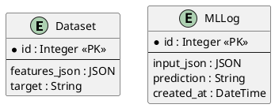

# 🏗️ Architecture du Projet

## Vue d'Ensemble

API REST de prédiction du turnover des employés basée sur Machine Learning.

```
┌─────────────┐      ┌──────────────┐      ┌─────────────┐
│   Client    │─────▶│  FastAPI     │─────▶│  PostgreSQL │
│  (Gradio/   │      │  (api.py)    │      │  (Logs +    │
│   cURL)     │◀─────│              │◀─────│   Dataset)  │
└─────────────┘      └──────────────┘      └─────────────┘
                            │
                            ▼
                     ┌──────────────┐
                     │  XGBoost     │
                     │  Model       │
                     │  (Pipeline)  │
                     └──────────────┘
```

## Composants Principaux

### 1. API Layer (FastAPI)
- **Fichier** : `api.py`
- **Rôle** : Exposition des endpoints REST
- **Endpoints clés** :
  - `GET /health` : Health check
  - `POST /predict` : Prédiction unitaire
  - `POST /predict-batch` : Prédiction batch (CSV)
- **Middlewares** :
  - Authentification par API Key (production)
  - Rate limiting (20 req/min en prod)
  - Logging structuré

### 2. Machine Learning (XGBoost + Pipeline)
- **Fichiers** : `ml_model/train_model.py`, `src/models.py`
- **Algorithme** : XGBoost avec SMOTE pour équilibrage
- **Performance** : F1 Score 0.85 | Recall 88%
- **Pipeline** :
  1. Preprocessing (encodage, normalisation)
  2. Feature engineering
  3. Prédiction XGBoost
  4. Post-processing

### 3. Base de Données (PostgreSQL)
- **Fichiers** : `db_models.py`, `scripts/create_db.py`
- **Tables** :
  - `dataset` : Données d'entraînement (1470 employés)
  - `ml_logs` : Logs des prédictions (traçabilité)
- **ORM** : SQLAlchemy

### 4. Interface Utilisateur (Gradio)
- **Fichier** : `src/gradio_ui.py`
- **Fonctionnalités** :
  - Formulaire interactif pour prédiction unitaire
  - Upload CSV pour batch
  - Visualisation des résultats

### 5. CI/CD (GitHub Actions)
- **Fichier** : `.github/workflows/ci-cd.yml`
- **Pipeline** :
  1. Lint (Black + Flake8)
  2. Tests (pytest avec 97 tests)
  3. Déploiement automatique vers HuggingFace Spaces

## Schéma de Base de Données



### Description des Tables

**dataset**
- `id` : Clé primaire auto-incrémentée
- `features_json` : Données complètes de l'employé (JSON : age, genre, salaire, etc.)
- `target` : Résultat attendu ('Oui' = quittera | 'Non' = restera)

**ml_logs**
- `id` : Clé primaire auto-incrémentée
- `input_json` : Données envoyées au modèle (JSON)
- `prediction` : Résultat de la prédiction ('Oui' | 'Non')
- `created_at` : Timestamp de la prédiction

## Flux de Données

### Prédiction Unitaire

```
1. Client envoie JSON → POST /predict
2. API valide données (Pydantic schemas)
3. Preprocessing → Feature engineering
4. Model.predict() → XGBoost
5. Log vers PostgreSQL (ml_logs)
6. Retour JSON avec probabilité
```

### Entraînement du Modèle

```
1. Chargement dataset depuis PostgreSQL
2. Preprocessing (src/preprocessing.py)
3. Train/Test Split (80/20)
4. SMOTE sur train set (équilibrage classes)
5. GridSearchCV pour hyperparamètres
6. Sauvegarde modèle (joblib → model.pkl)
7. Métriques (F1, Recall, Precision)
```

## Environnements

| Environnement | DEBUG | Auth | Rate Limit | URL |
|---------------|-------|------|------------|-----|
| **Dev** | true | ❌ | ❌ | localhost:8000 |
| **Test** | false | ✅ | ❌ | N/A (CI/CD) |
| **Prod** | false | ✅ | ✅ | HF Spaces |

## Technologies

- **Backend** : Python 3.12+, FastAPI 0.127
- **ML** : XGBoost 2.0.3, scikit-learn, imbalanced-learn
- **Database** : PostgreSQL 13+, SQLAlchemy 2.0
- **UI** : Gradio 4.0
- **Testing** : pytest, pytest-cov (97 tests)
- **Deployment** : HuggingFace Spaces, GitHub Actions
- **Tools** : Poetry, Black, Flake8

## Structure de Projet

```
OC_P5/
├── api.py              # API FastAPI
├── app.py              # Point d'entrée (Gradio + API)
├── db_models.py        # Modèles SQLAlchemy
├── src/
│   ├── auth.py         # Authentification API Key
│   ├── config.py       # Configuration (Pydantic Settings)
│   ├── gradio_ui.py    # Interface Gradio
│   ├── logger.py       # Logging structuré
│   ├── models.py       # Chargement modèle ML
│   ├── preprocessing.py# Preprocessing données
│   └── schemas.py      # Schémas Pydantic
├── ml_model/
│   ├── train_model.py  # Entraînement XGBoost
│   └── preprocess.py   # Feature engineering
├── scripts/
│   ├── create_db.py    # Création BDD
│   └── insert_dataset.py # Insertion données
├── tests/              # 97 tests (API, DB, Model, Functional)
└── docs/               # Documentation (ce fichier)
```

## Sécurité

- **API Key** : Header `X-API-Key` (production uniquement)
- **Secrets** : Variables d'environnement (.env)
- **Rate Limiting** : 20 requêtes/minute par IP
- **Validation** : Pydantic pour toutes les entrées
- **Logs** : Pas d'exposition de données sensibles

## Monitoring

- **Logs** : JSON structuré dans PostgreSQL (`ml_logs`)
- **Health Check** : `GET /health` (status + modèle chargé)
- **Metrics** : Couverture de tests 80%+ (pytest-cov)
